# Mall Customer Segmentation 

Roy Wu   
  
July 2021

 

 <font size="1" > Image source:  [<span style="color: grey" > CF Toronto Eaton Centre</span>](https://shops.cadillacfairview.com/property/cf-toronto-eaton-centre)</font>
 
 

The dataset of this project comes from the Kaggle [Mall Customer Segmentation Data](https://www.kaggle.com/vjchoudhary7/customer-segmentation-tutorial-in-python). Unsupervised learning machine learning technique (KMeans Clustering) will be utilized. The goal of this project is to divide customers into multiple groups based on certain traits that would assist designing marketing strategies.

## 1. Import Dataset and Libraries


```python
import numpy as np
import pandas as pd
import matplotlib.pyplot as plt
import seaborn as sns
import warnings
from matplotlib.pyplot import figure
from mpl_toolkits.mplot3d import Axes3D
from sklearn.cluster import KMeans

warnings.filterwarnings("ignore")
pd.plotting.register_matplotlib_converters()
%matplotlib inline
```


```python
df = pd.read_csv(
    "/Users/roywu/Documents/Customer Segmentation/Mall_Customers.csv")
```

## 2. Data Preprocessing


```python
df.columns
```


    Index(['CustomerID', 'Gender', 'Age', 'Annual Income (k$)',
           'Spending Score (1-100)'],
          dtype='object')


```python
df.columns
```


    Index(['gender', 'age', 'income', 'score'], dtype='object')


```python
df.head()
```


<div>
<style scoped>
    .dataframe tbody tr th:only-of-type {
        vertical-align: middle;
    }

    .dataframe tbody tr th {
        vertical-align: top;
    }

    .dataframe thead th {
        text-align: right;
    }
</style>
<table border="1" class="dataframe">
  <thead>
    <tr style="text-align: right;">
      <th></th>
      <th>CustomerID</th>
      <th>Gender</th>
      <th>Age</th>
      <th>Annual Income (k$)</th>
      <th>Spending Score (1-100)</th>
    </tr>
  </thead>
  <tbody>
    <tr>
      <th>0</th>
      <td>1</td>
      <td>Male</td>
      <td>19</td>
      <td>15</td>
      <td>39</td>
    </tr>
    <tr>
      <th>1</th>
      <td>2</td>
      <td>Male</td>
      <td>21</td>
      <td>15</td>
      <td>81</td>
    </tr>
    <tr>
      <th>2</th>
      <td>3</td>
      <td>Female</td>
      <td>20</td>
      <td>16</td>
      <td>6</td>
    </tr>
    <tr>
      <th>3</th>
      <td>4</td>
      <td>Female</td>
      <td>23</td>
      <td>16</td>
      <td>77</td>
    </tr>
    <tr>
      <th>4</th>
      <td>5</td>
      <td>Female</td>
      <td>31</td>
      <td>17</td>
      <td>40</td>
    </tr>
  </tbody>
</table>
</div>


```python
df.drop('CustomerID', axis=1, inplace=True)
df.columns = ['gender', 'age', 'income', 'score']
```

The column CustomerID will be removed because it 


```python
df.shape
```


    (200, 4)


```python
df.describe()
```


<div>
<style scoped>
    .dataframe tbody tr th:only-of-type {
        vertical-align: middle;
    }

    .dataframe tbody tr th {
        vertical-align: top;
    }

    .dataframe thead th {
        text-align: right;
    }
</style>
<table border="1" class="dataframe">
  <thead>
    <tr style="text-align: right;">
      <th></th>
      <th>age</th>
      <th>income</th>
      <th>score</th>
    </tr>
  </thead>
  <tbody>
    <tr>
      <th>count</th>
      <td>200.000000</td>
      <td>200.000000</td>
      <td>200.000000</td>
    </tr>
    <tr>
      <th>mean</th>
      <td>38.850000</td>
      <td>60.560000</td>
      <td>50.200000</td>
    </tr>
    <tr>
      <th>std</th>
      <td>13.969007</td>
      <td>26.264721</td>
      <td>25.823522</td>
    </tr>
    <tr>
      <th>min</th>
      <td>18.000000</td>
      <td>15.000000</td>
      <td>1.000000</td>
    </tr>
    <tr>
      <th>25%</th>
      <td>28.750000</td>
      <td>41.500000</td>
      <td>34.750000</td>
    </tr>
    <tr>
      <th>50%</th>
      <td>36.000000</td>
      <td>61.500000</td>
      <td>50.000000</td>
    </tr>
    <tr>
      <th>75%</th>
      <td>49.000000</td>
      <td>78.000000</td>
      <td>73.000000</td>
    </tr>
    <tr>
      <th>max</th>
      <td>70.000000</td>
      <td>137.000000</td>
      <td>99.000000</td>
    </tr>
  </tbody>
</table>
</div>


```python
df.isnull().any()
```


    gender    False
    age       False
    income    False
    score     False
    dtype: bool


## 3. EDA & Data Visualization 


```python
sns.set_theme(style="ticks")
plt.figure(figsize=(25, 15))
plt.subplot(2, 3, 1)
sns.distplot(df.age[df['gender'] == 'Female'],
             color="hotpink", hist=False, label='Female')
sns.distplot(df.age[df['gender'] == 'Male'],
             color="lightseagreen", hist=False, kde=True,  label='Male')
plt.xlabel("Age")
plt.legend()

plt.subplot(2, 3, 2)
sns.distplot(df.score[df['gender'] == 'Female'],
             color="hotpink", hist=False, label='Female')
sns.distplot(df.score[df['gender'] == 'Male'],
             color="lightseagreen", hist=False, label='Male')
plt.xlabel("Spending Score (1-100)")
plt.legend()

plt.subplot(2, 3, 3)
sns.distplot(df.income[df['gender'] == 'Female'],
             color="hotpink", hist=False, label='Female')
sns.distplot(df.income[df['gender'] == 'Male'],
             color="lightseagreen", hist=False, label='Male')
plt.xlabel("Annual Income (k$)")
plt.legend()

plt.subplot(2, 3, 4)
sns.distplot(df.age[df['gender'] == 'Female'],
             color="hotpink", hist=True, kde=False, label='Female')
sns.distplot(df.age[df['gender'] == 'Male'],
             color="lightseagreen", hist=True, kde=False, label='Male')
plt.xlabel("Age")
plt.ylabel("Frequency")
plt.legend()

plt.subplot(2, 3, 5)
sns.distplot(df.score[df['gender'] == 'Female'],
             color="hotpink", hist=True, kde=False, label='Female')
sns.distplot(df.score[df['gender'] == 'Male'],
             color="lightseagreen", hist=True, kde=False, label='Male')
plt.xlabel("Spending Score (1-100)")
plt.ylabel("Frequency")
plt.legend()

plt.subplot(2, 3, 6)
sns.distplot(df.income[df['gender'] == 'Female'],
             color="hotpink", hist=True, kde=False, label='Female')
sns.distplot(df.income[df['gender'] == 'Male'],
             color="lightseagreen", hist=True, kde=False, label='Male')
plt.xlabel("Annual Income (k$)")
plt.ylabel("Frequency")
plt.legend()

plt.legend()
plt.show()
```


    
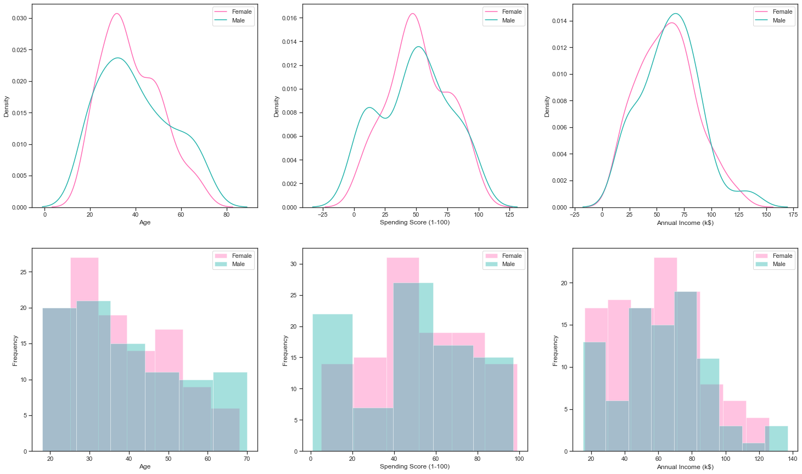
    


```python
sns.set_theme(palette="Blues")

df.groupby('gender', axis=0).size().plot(kind='pie',
                                         figsize=(8, 8),
                                         autopct='%1.1f%%',
                                         startangle=45,
                                         shadow=True,
                                         fontsize=15
                                         )

plt.title('Distribution of Gender', fontsize=20)
plt.ylabel('')

plt.show()
```


    
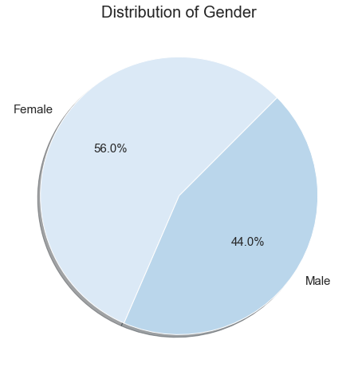
    


```python
sns.set_theme(style="ticks", palette="Set1")
plt.figure(figsize=(15, 10))

sns.boxplot(x="gender",
            y="income",
            data=df
            )
sns.set(font_scale=2)
plt.title("Gender and Annual Income")

plt.show()
```


    
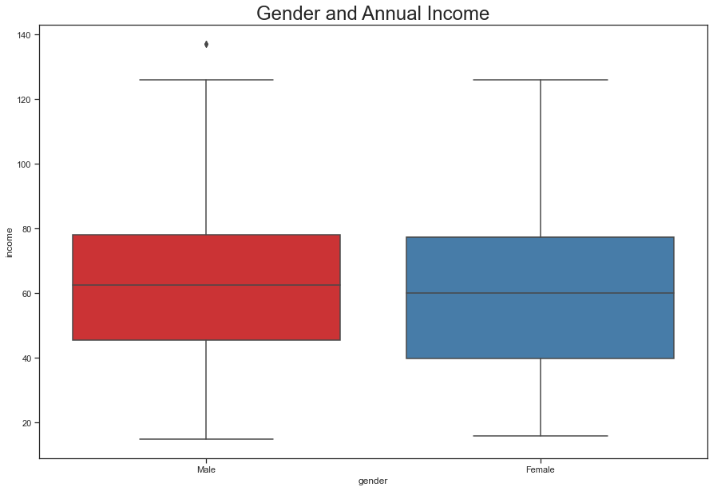
    


```python
plt.figure(figsize=(10, 8))
sns.heatmap(df.corr(), cmap='flare', annot=True)
plt.title('Correlation Between Each Variable')
sns.set(font_scale=1.2)

plt.show()
```


    
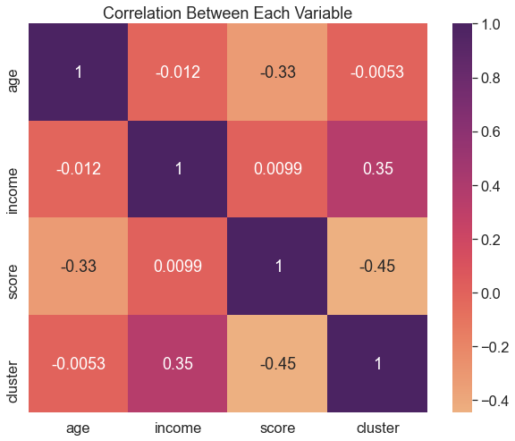
    


```python
sns.set_theme(style="ticks", palette="Set1")

sns.lmplot(x="age",
           y="score",
           hue="gender",
           data=df,
           markers=["+", "o"],
           height=10
           )
sns.set(font_scale=2)
plt.title("Age and Spending Score")

plt.show()
```


    
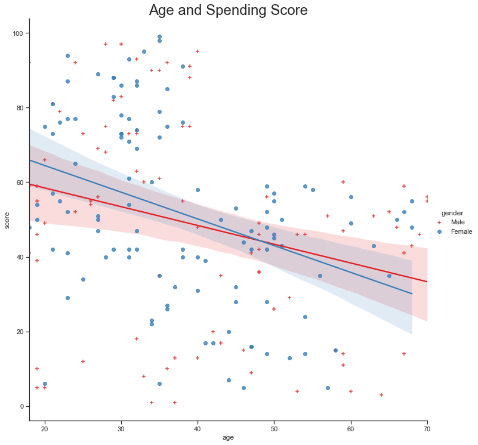
    


```python
sns.set_theme(style="ticks", palette="icefire")
plt.figure(figsize=(15, 10))

sns.regplot(x="age",
            y="income",
            data=df
            )
sns.set(font_scale=2)
plt.title("Age and Annual Income")

plt.show()
```


    
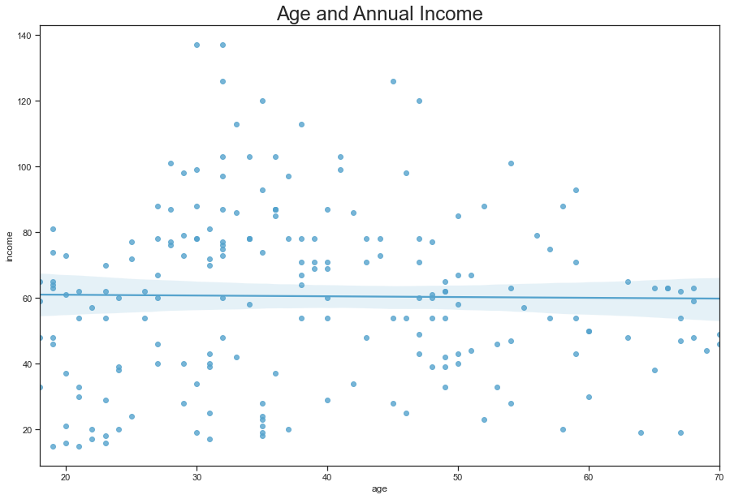
    


```python
sns.set_theme(style="ticks", palette="icefire")
plt.figure(figsize=(15, 10))

sns.scatterplot(
    data=df,
    x="income",
    y="score",
    hue="gender",
    s=150
)

sns.set(font_scale=2)
plt.title("Annual Income and Spending Score")


plt.show()
```


    
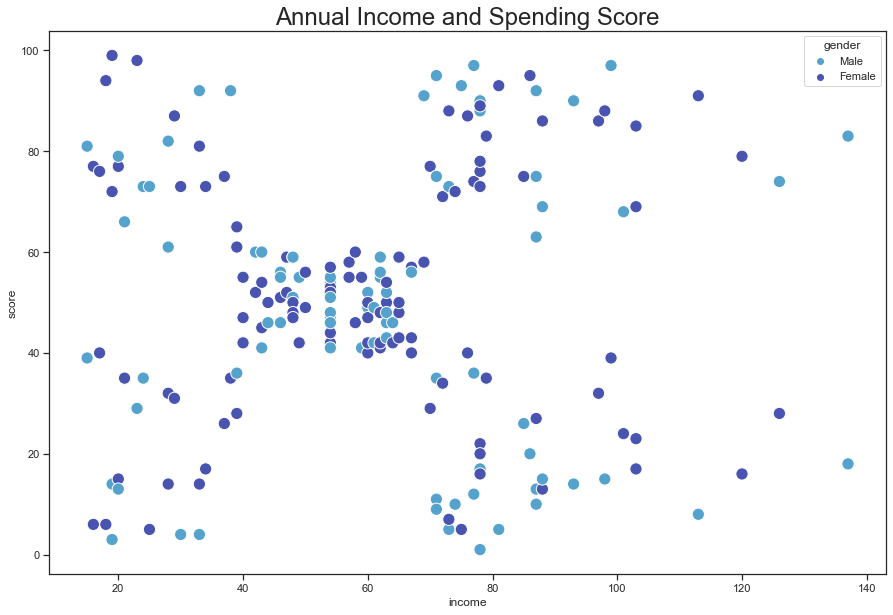
    


## 4. Clustering using K- means

### 4.1 Age and Spending Score


```python
df.head()
```


<div>
<style scoped>
    .dataframe tbody tr th:only-of-type {
        vertical-align: middle;
    }

    .dataframe tbody tr th {
        vertical-align: top;
    }

    .dataframe thead th {
        text-align: right;
    }
</style>
<table border="1" class="dataframe">
  <thead>
    <tr style="text-align: right;">
      <th></th>
      <th>gender</th>
      <th>age</th>
      <th>income</th>
      <th>score</th>
    </tr>
  </thead>
  <tbody>
    <tr>
      <th>0</th>
      <td>Male</td>
      <td>19</td>
      <td>15</td>
      <td>39</td>
    </tr>
    <tr>
      <th>1</th>
      <td>Male</td>
      <td>21</td>
      <td>15</td>
      <td>81</td>
    </tr>
    <tr>
      <th>2</th>
      <td>Female</td>
      <td>20</td>
      <td>16</td>
      <td>6</td>
    </tr>
    <tr>
      <th>3</th>
      <td>Female</td>
      <td>23</td>
      <td>16</td>
      <td>77</td>
    </tr>
    <tr>
      <th>4</th>
      <td>Female</td>
      <td>31</td>
      <td>17</td>
      <td>40</td>
    </tr>
  </tbody>
</table>
</div>


```python
# Subesetting the age and spending score columns
X = df.loc[:, ['age', 'score']].values

# Determining the optimal number of clusters using the Elbow Mmethod
k = []

for i in range(1, 11):
    kmeans = KMeans(n_clusters=i, init='k-means++', random_state=0)
    kmeans.fit(X)
    k.append(kmeans.inertia_)
```


```python
# Plot the result of the Elbow Mmethod and identidy the optimal number of clusters
sns.set_theme(style="ticks")

plt.figure(figsize=(15, 10))
plt.plot(range(1, 11), k)
plt.plot(np.arange(1, 11), inertia, 's', color="red")
plt.plot(np.arange(1, 11), inertia, '-', color='blue')
plt.title('The Elbow Method')
plt.xlabel('Number of clusters')
plt.ylabel('WCSS')

plt.show()
```


    
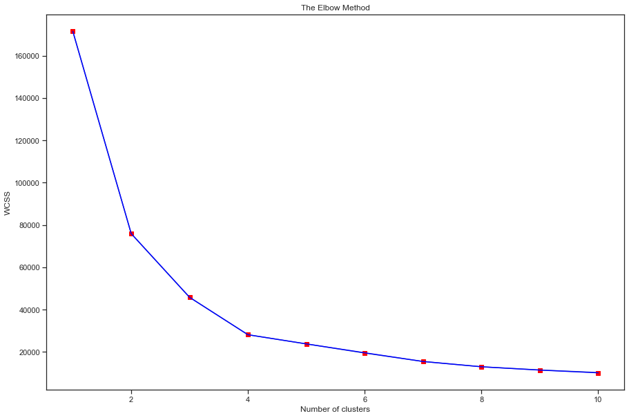
    


```python
# Elbow Method indicates that 5 is the optimal number of clusters
model_1 = KMeans(n_clusters=5, init='k-means++', random_state=0)
y_kmeans = model_1.fit_predict(X)
```


```python
sns.set_theme(style="ticks", palette='bright')
plt.figure(1, figsize=(15, 10))

# Cluster 1
plt.scatter(X[y_kmeans == 0, 0], X[y_kmeans == 0, 1],
            s=150, label='Cluster 1')
# Cluster 2
plt.scatter(X[y_kmeans == 1, 0], X[y_kmeans ==1, 1], 
            s=150, label='Cluster 2')
# Cluster 3
plt.scatter(X[y_kmeans == 2, 0], X[y_kmeans ==2, 1], 
            s=150, label='Cluster 3')
# Cluster 4
plt.scatter(X[y_kmeans == 3, 0], X[y_kmeans == 3, 1],
            s=150, label='Cluster 4')
# Cluster 5
plt.scatter(X[y_kmeans == 4, 0], X[y_kmeans ==4, 1], 
            s=150, label='Cluster 5')
# Centroids
plt.scatter(model_1.cluster_centers_[:, 0], model_1.cluster_centers_[:, 1], 
            s=250, color='black', label='Centroids')

plt.title('K Means Clustering: Age and Spending Score')
plt.xlabel('Age')
plt.ylabel('Spending Score (1-100)')
plt.legend()

plt.show()
```


    
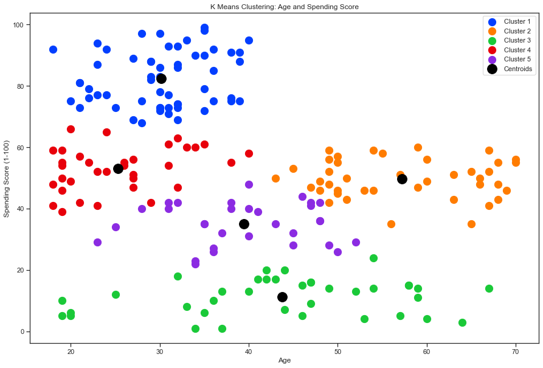
    


Based on the Age and Spending Store segmentation, customers can be grouped into the following clusters:  
- **Cluster 1 (Blue)**: Youngsters and middle-aged individuals who spend a lot  
- **Cluster 2 (Red)**: Youngsters and middle-aged individuals who spend moderately
- **Cluster 3 (Orange)**: Elderlies who spend moderately
- **Cluster 4 (Purple)**: Middle-aged individuals who spend moderately  
- **Cluster 5 (Green)**: The entire population of individuals who are with low spendings 

### 4.2 Age and Annual Income


```python
Y = df.loc[:, ['age', 'income']].values

model_2 = KMeans(n_clusters=5, init='k-means++', random_state=0)
model_2.fit(Y)
y_kmeans_2 = model_1.fit_predict(Y)
```


```python
sns.set_theme(style="ticks", palette='bright')
plt.figure(1, figsize=(15, 10))

# Cluster 1
plt.scatter(Y[y_kmeans_2 == 0, 0], Y[y_kmeans_2 == 0, 1],
            s=150, label='Cluster 1')
# Cluster 2
plt.scatter(Y[y_kmeans_2 == 1, 0], Y[y_kmeans_2 ==1, 1], 
            s=150, label='Cluster 2')
# Cluster 3
plt.scatter(Y[y_kmeans_2 == 2, 0], Y[y_kmeans_2 ==2, 1], 
            s=150, label='Cluster 3')
# Cluster 4
plt.scatter(Y[y_kmeans_2 == 3, 0], Y[y_kmeans_2 == 3, 1],
            s=150, label='Cluster 4')
# Cluster 5
plt.scatter(Y[y_kmeans_2 == 4, 0], Y[y_kmeans_2 ==4, 1], 
            s=150, label='Cluster 5')
# Centroids
plt.scatter(model_2.cluster_centers_[:, 0], model_2.cluster_centers_[:, 1], 
            s=250, color='black', label='Centroids')

plt.title('K Means Clustering: Age and Annual Income')
plt.xlabel('Age')
plt.ylabel('Annual Income (K$)')
plt.legend()

plt.show()
```


    
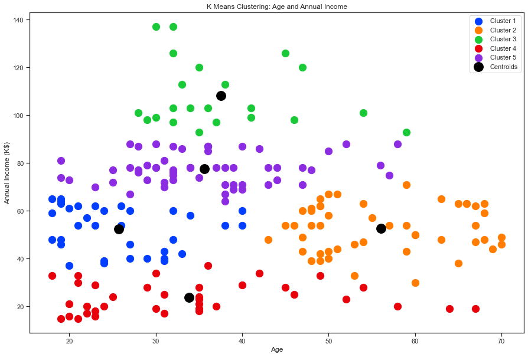
    


Based on the Age and Spending Store segmentation, customers can be grouped into the following clusters:  
- **Cluster 1 (Green)**: Middle-aged who are with high income
- **Cluster 2 (Purple)**: Middle-aged and elderlies who are with middle to high income
- **Cluster 3 (Blue)**: Youngsters and middle-aged who are with middle income
- **Cluster 4 (Orange)**: Elderlies who are with middle income
- **Cluster 5 (Red)**: The entire population of individuals who are with low income 

### 4.3 Annual Income and Spending Score


```python
Z = df.loc[:, ['income', 'score']].values

model_3 = KMeans(n_clusters=5, init='k-means++', random_state=0)
model_3.fit(Z)
y_kmeans_3 = model_1.fit_predict(Z)
```


```python
sns.set_theme(style="ticks", palette='bright')
plt.figure(1, figsize=(15, 10))

# Cluster 1
plt.scatter(Z[y_kmeans_3 == 0, 0], Z[y_kmeans_3 == 0, 1],
            s=150, label='Cluster 1')
# Cluster 2
plt.scatter(Z[y_kmeans_3 == 1, 0], Z[y_kmeans_3 ==1, 1], 
            s=150, label='Cluster 2')
# Cluster 3
plt.scatter(Z[y_kmeans_3 == 2, 0], Z[y_kmeans_3 ==2, 1], 
            s=150, label='Cluster 3')
# Cluster 4
plt.scatter(Z[y_kmeans_3 == 3, 0], Z[y_kmeans_3 == 3, 1],
            s=150, label='Cluster 4')
# Cluster 5
plt.scatter(Z[y_kmeans_3 == 4, 0], Z[y_kmeans_3 ==4, 1], 
            s=150, label='Cluster 5')
# Centroids
plt.scatter(model_3.cluster_centers_[:, 0], model_3.cluster_centers_[:, 1], 
            s=250, color='black', label='Centroids')

plt.title('K Means Clustering: Spending Score and Annual Income')
plt.xlabel('Annual Income (K$)')
plt.ylabel('Spending Score (1-100)')
plt.legend()

plt.show()
```


    
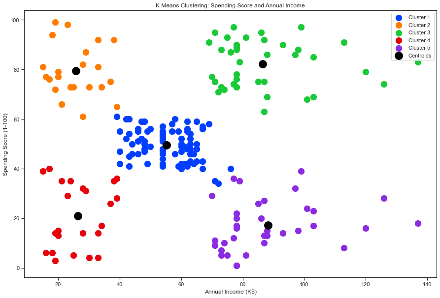
    


Based on the Annual Income and Spending Store segmentation, customers can be grouped into the following clusters:  
- **Cluster 1 (Orange)**: Low annual income with high spending score 
- **Cluster 2 (Green)**: High annual income with high spending score
- **Cluster 3 (Blue)**: Middle annual income with middle spending score
- **Cluster 4 (Red)**: Low annual income with low spending score 
- **Cluster 5 (Purple)**: High annual income with low spending score 

### 4.4 Clustering with three features: Age, Annual Income and Spending Score

**Method 1:**


```python
labels=model_3.labels_

df['cluster']=labels
```


```python
df['cluster'].values
```


    array([3, 1, 3, 1, 3, 1, 3, 1, 3, 1, 3, 1, 3, 1, 3, 1, 3, 1, 3, 1, 3, 1,
           3, 1, 3, 1, 3, 1, 3, 1, 3, 1, 3, 1, 3, 1, 3, 1, 3, 1, 3, 1, 3, 0,
           3, 1, 0, 0, 0, 0, 0, 0, 0, 0, 0, 0, 0, 0, 0, 0, 0, 0, 0, 0, 0, 0,
           0, 0, 0, 0, 0, 0, 0, 0, 0, 0, 0, 0, 0, 0, 0, 0, 0, 0, 0, 0, 0, 0,
           0, 0, 0, 0, 0, 0, 0, 0, 0, 0, 0, 0, 0, 0, 0, 0, 0, 0, 0, 0, 0, 0,
           0, 0, 0, 0, 0, 0, 0, 0, 0, 0, 0, 0, 0, 2, 4, 2, 0, 2, 4, 2, 4, 2,
           0, 2, 4, 2, 4, 2, 4, 2, 4, 2, 0, 2, 4, 2, 4, 2, 4, 2, 4, 2, 4, 2,
           4, 2, 4, 2, 4, 2, 4, 2, 4, 2, 4, 2, 4, 2, 4, 2, 4, 2, 4, 2, 4, 2,
           4, 2, 4, 2, 4, 2, 4, 2, 4, 2, 4, 2, 4, 2, 4, 2, 4, 2, 4, 2, 4, 2,
           4, 2], dtype=int32)


```python
fig = plt.figure(figsize=(20, 15), dpi=75)
ax = fig.add_subplot(111, projection='3d')

x = np.array(df['age'])
y = np.array(df['income'])
z = np.array(df['score'])
ax.scatter(x,y,z, c=df["cluster"], s=200)

ax.set_xlabel('Age')
ax.set_ylabel('Annual Income (K$)')
ax.set_zlabel('Spending Sore (1-100)')

plt.title('K Means Clustering: Age, Spending Score and Annual Income')
plt.show()
```


    
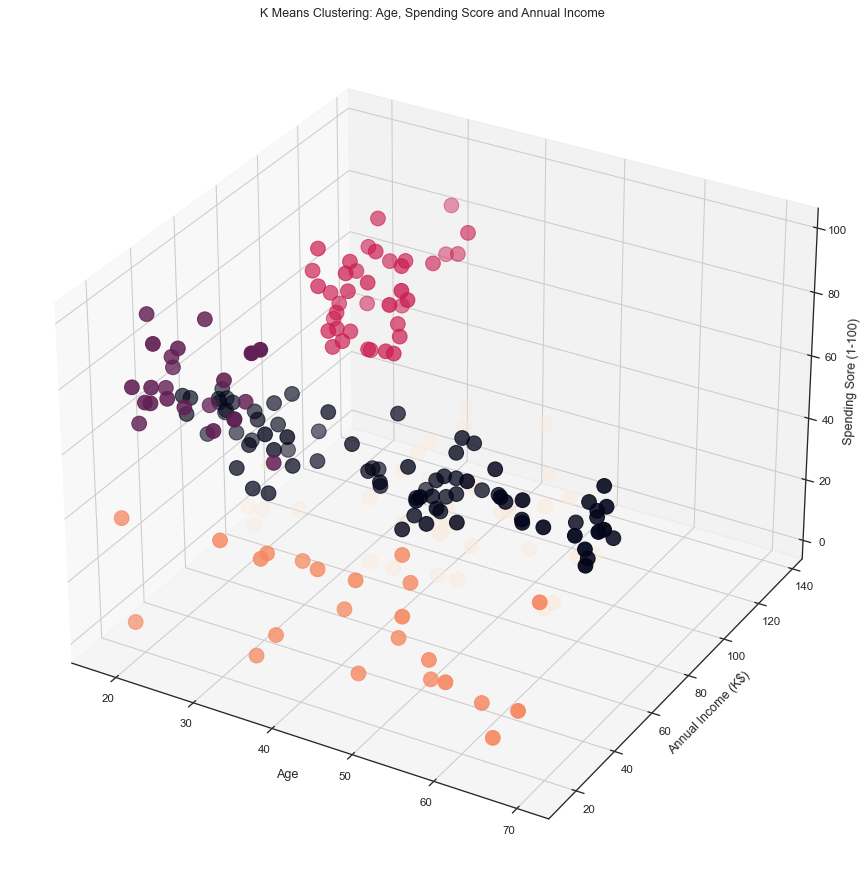
    


**Method 2:**


```python
z=df.loc[:,['age','income','score']].values

model_3d = KMeans(n_clusters=5, init='k-means++', random_state=0)
model_3d.fit(z)
     
y_kmeans_3d = model_3d.fit_predict(z)
```


```python
fig = plt.figure(figsize=(20, 15))
ax = fig.add_subplot(111, projection='3d')

ax.scatter(z[y_kmeans_3d == 0, 0], z[y_kmeans_3d == 0, 1],z[y_kmeans_3d == 0, 2],
           s=200, color='blue', label="Cluster 1", marker="d")
ax.scatter(z[y_kmeans_3d == 1, 0], z[y_kmeans_3d == 1, 1], z[y_kmeans_3d == 1, 2],
           s=200, color='orange', label="Cluster 2", marker="s")
ax.scatter(z[y_kmeans_3d == 2, 0], z[y_kmeans_3d == 2, 1], z[y_kmeans_3d == 2, 2],
            s=200, color='green', label="Cluster 3", marker="o")
ax.scatter(z[y_kmeans_3d == 3, 0], z[y_kmeans_3d == 3, 1],z[y_kmeans_3d == 3, 2],
           s=200, color='#D12B60', label="Cluster 4", marker="h")
ax.scatter(z[y_kmeans_3d == 4, 0], z[y_kmeans_3d == 4, 1],z[y_kmeans_3d == 4, 2],
            s=200, color='purple', label="Cluster 5", marker="P")


ax.set_xlabel('Age')
ax.set_ylabel('Anual Income (K$)')
ax.set_zlabel('Spending Score (1-100)')
ax.legend()

plt.title('K Means Clustering: Age, Spending Score and Annual Income')
plt.show()
```


    
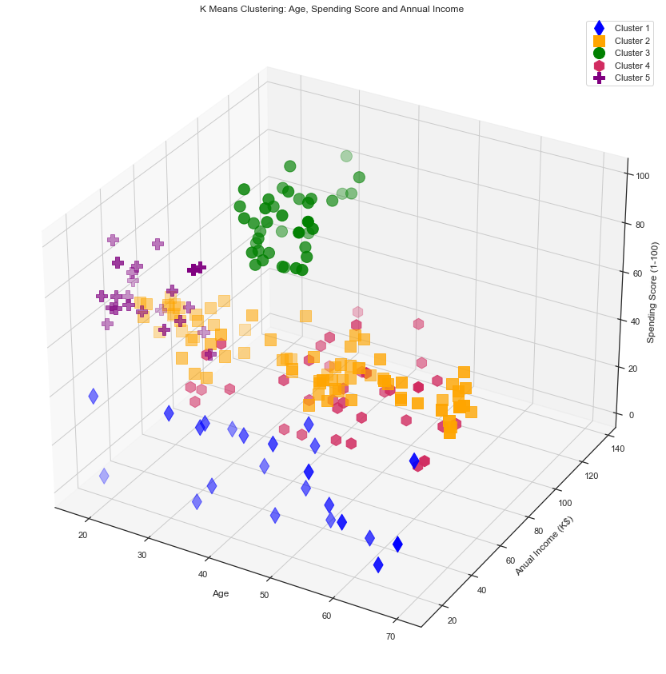
    


Based on the Age, Annual Income and Spending Store segmentation, customers can be grouped into the following clusters:  
- **Cluster 1 (Purple)**: Youngsters with low annual income and high spending score 
- **Cluster 2 (Green)**: Youngsters and middle-aged people with high annual income and high spending score
- **Cluster 3 (Orange)**: The entire population of individuals with middle annual income and middle spending score  
- **Cluster 4 (Blue)**: The entire population of individuals with low annual income and low spending score 
- **Cluster 5 (Red)**: Youngsters and middle-aged people with high annual income and low spending score 
